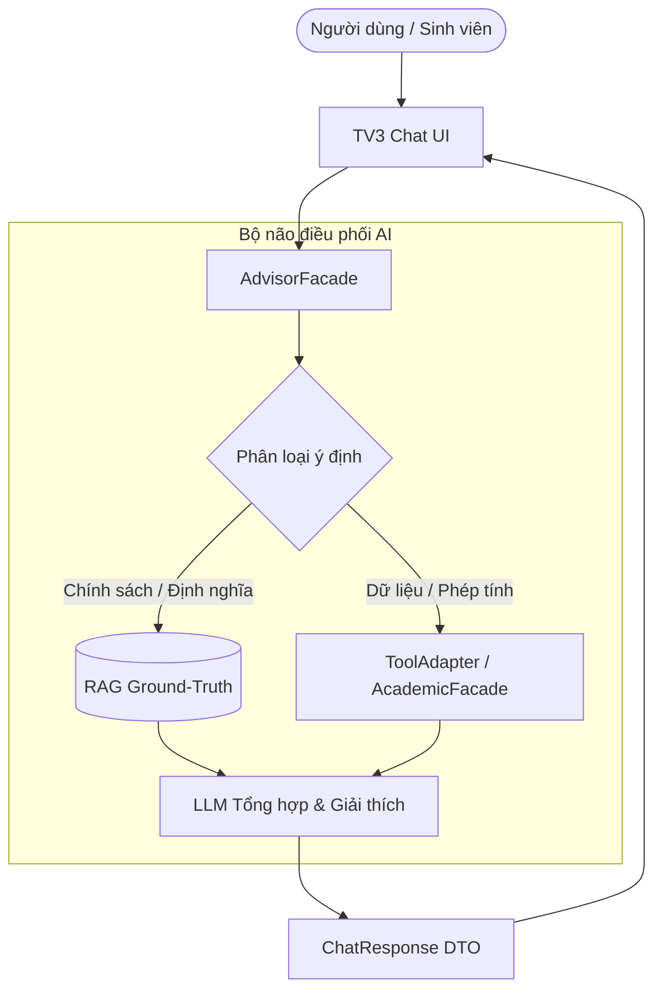

# SPECIFICATION: CHAT BEHAVIOR & RAG SOURCE CATALOG (HAUI ADVISOR)

- **Mã định danh:** `SPEC-TV1-2.2e-CHAT-RAG`
- **Module phụ trách:** `tv1-ai` (TV1 Lead + AI)
- **Giai đoạn áp dụng:** Phase 2 (Task 2.2e) — Chuẩn hóa hành vi và dữ liệu RAG
- **Tài liệu tham chiếu:**
  - PRD FR-05 (AI Chatbot Cố vấn Học vụ), FR-06 (Contextual Multi-turn), FR-07 (RAG Quy chế)
  - Kiến trúc hệ thống HaUI Advisor Solution v1
  - Shared Contracts: [`ChatResponse.java`](file:///E:/thuctapcosonganh/tv5-platform/contracts/src/main/java/vn/haui/advisor/contracts/dto/ChatResponse.java), [`ChatSourceItem.java`](file:///E:/thuctapcosonganh/tv5-platform/contracts/src/main/java/vn/haui/advisor/contracts/dto/ChatSourceItem.java), [`AcademicFacade.java`](file:///E:/thuctapcosonganh/tv5-platform/contracts/src/main/java/vn/haui/advisor/contracts/ports/AcademicFacade.java)

---

## 1. Mục tiêu và Phạm vi Task 2.2e

Task 2.2e xác lập **quy chuẩn hành vi hội thoại học vụ** và **danh mục nguồn tri thức RAG** chính thức làm nền tảng kiểm thử và tích hợp cho:
- **TV3 (Planner & Chat UI):** Dựng giao diện tương tác, hiển thị trích dẫn (citation), gợi ý prompt nhanh và xử lý các trạng thái cảnh báo/hành động.
- **TV1 Task 3.3 (RAG Pipeline):** Cắt lát văn bản (chunking), lập chỉ mục vector (embedding/pgvector) theo đúng metadata quy định.
- **TV1 Task 3.8 (AI Orchestration):** Cấu hình Function Calling / Tool Calling với Gemini và Spring AI tuân thủ hợp đồng nghiêm ngặt.

> [!IMPORTANT]
> **Giới hạn phạm vi (Scope Boundary):**
> Task 2.2e chỉ xây dựng **Đặc tả hành vi (Specification)**, **Danh mục nguồn RAG (Catalog)**, và **Bộ dữ liệu kiểm chuẩn (Eval Dataset)**.
> - **KHÔNG** triển khai PgVectorStore, Embeddings hay Ingestion pipeline (thuộc Task 3.3).
> - **KHÔNG** gọi API Gemini thật hay mở rộng `ToolAdapter` (thuộc Task 3.8).
> - **KHÔNG** ghi dữ liệu vào CSDL hay thay đổi REST Controller (thuộc TV5).

---

## 2. Phân định Trách nhiệm: RAG vs Academic Tools vs LLM

Hệ thống tư vấn học vụ HaUI Advisor tuân thủ nguyên tắc phân tách trách nhiệm tuyệt đối giữa ba trụ cột:



### 2.1. Nguồn RAG (Knowledge Base Ground-Truth)
- **Nhiệm vụ:** Cung cấp căn cứ pháp lý, quy chế đào tạo, định nghĩa học phần, ngưỡng cảnh báo, điều kiện tốt nghiệp, quy tắc tính toán chuẩn.
- **Dữ liệu:** Các văn bản Markdown trong `data-source/documents/**`.
- **Đặc điểm:** Dùng chung cho toàn bộ sinh viên, không mang tính cá nhân hóa.

### 2.2. Công cụ Học vụ (Academic Tools / AcademicFacade)
- **Nhiệm vụ:**
  - Tra cứu dữ liệu học tập cá nhân (`getAcademicStatus`): CPA, GPA, tín chỉ tích lũy, môn nợ F, môn D/D+.
  - Kiểm tra điều kiện tiên quyết / môn học trước (`checkCourseEligibility`).
  - Sinh kế hoạch học tập đề xuất (`generateStudyPlan`).
  - Thẩm định kế hoạch học tập (`validateStudyPlan`).
  - Giả lập điểm số học kỳ tương lai (`simulateGrades`).
  - Xếp hạng ROI các môn học cải thiện (`rankRetakeCourses`).
  - Tính toán điểm mục tiêu cho từng kỳ (`calculateTargetGrades`).
  - Rà soát điều kiện tốt nghiệp (`runGraduationAudit`).
  - Đồng bộ lại kế hoạch học tập khi hồ sơ thay đổi (`reconcileStudyPlan`).
- **Đặc điểm:** Toàn bộ phép tính toán học, logic điều kiện và đồ thị tiên quyết do code chuyên biệt xử lý (BigDecimal, Deterministic Engine).

### 2.3. Mô hình Ngôn ngữ Lớn (LLM / AdvisorModel)
- **Được phép làm:**
  - Hiểu ngôn ngữ tự nhiên của sinh viên, bóc tách thực thể và ý định.
  - Tổng hợp dữ liệu từ RAG và Tool thành câu trả lời sư phạm, mạch lạc, dễ hiểu.
  - Đặt câu hỏi làm rõ (`should_ask_clarification = true`) khi sinh viên cung cấp thiếu tham số cần thiết.
  - Gợi ý các hành động tiếp theo (`actions`) và cảnh báo (`warnings`).
- **TUYỆT ĐỐI KHÔNG ĐƯỢC LÀM (Anti-Hallucination Invariants):**
  1. **Không tự tính toán CPA/GPA:** Bắt buộc phải nhận kết quả từ `AcademicFacade` hoặc `simulateGrades`.
  2. **Không tự phán xét quan hệ môn học:** Không tự bịa môn A là tiên quyết của môn B nếu đồ thị môn học không xác nhận.
  3. **Không tự xếp hạng môn học cải thiện bằng cảm tính:** Phải gọi `rankRetakeCourses` để lấy chỉ số ROI.
  4. **Không tự tạo nguồn trích dẫn giả:** Cấm tạo mã nguồn không có trong catalog (ví dụ: `REG-HAUI-99`, `SRC_FAKE`).
  5. **Không tự khẳng định sinh viên đủ điều kiện tốt nghiệp:** Phải có kết quả thẩm định từ `runGraduationAudit`.
  6. **Không tự ý thay đổi dữ liệu hoặc kích hoạt kế hoạch:** Kế hoạch học tập do AI đề xuất chỉ là bản dự thảo (`ChatPlanProposal`), chỉ sinh viên mới có quyền phê duyệt/kích hoạt trên giao diện.

---

## 3. Danh mục Nguồn RAG (Source Catalog & Metadata Convention)

Tất cả tài liệu được chỉ mục vào hệ thống RAG phải tuân thủ chuẩn trích dẫn `ChatSourceItem`:
- `source_id`: Mã định danh nguồn chuẩn (bắt đầu bằng `REG-HAUI-`).
- `title`: Tên chính thức của văn bản.
- `version`: Chuỗi định danh phiên bản nội dung bất biến (`gitblob:<12 ký tự hex SHA>`).
- `section`: Phân cấp tiêu đề cụ thể theo cú pháp Markdown: `# Mục chính > ## Mục con`.
- `reference_url`: Đường dẫn tra cứu trên cổng thông tin đào tạo.
- `source_status`: `PROJECT_GROUND_TRUTH`.

| Source ID | Tiêu đề văn bản | Phiên bản (Git Blob SHA) | Đường dẫn file gốc | Trạng thái |
|:---|:---|:---|:---|:---:|
| `REG-HAUI-01` | Quy chế đào tạo theo hệ thống tín chỉ — HaUI | `gitblob:cab439dd3364` | `data-source/documents/01_quy_che_dao_tao_tin_chi_haui.md` | `PROJECT_GROUND_TRUTH` |
| `REG-HAUI-02` | Thang điểm đánh giá và phương pháp tính điểm GPA / CPA tại HaUI | `gitblob:0a22d0023279` | `data-source/documents/02_thang_diem_va_cach_tinh_gpa_cpa.md` | `PROJECT_GROUND_TRUTH` |
| `REG-HAUI-03` | Quy định học lại và học cải thiện điểm — HaUI | `gitblob:b7e379af2bf7` | `data-source/documents/03_quy_dinh_hoc_lai_va_hoc_cai_thien.md` | `PROJECT_GROUND_TRUTH` |
| `REG-HAUI-04` | Quy định cảnh báo học vụ và buộc thôi học — HaUI | `gitblob:f5f1503d4179` | `data-source/documents/04_quy_dinh_canh_bao_hoc_vu_va_buoc_thoi_hoc.md` | `PROJECT_GROUND_TRUTH` |
| `REG-HAUI-05` | Chuẩn đầu ra và điều kiện xét công nhận tốt nghiệp — HaUI | `gitblob:f45ea177a03d` | `data-source/documents/05_chuan_dau_ra_va_dieu_kien_tot_nghiep.md` | `PROJECT_GROUND_TRUTH` |

> [!NOTE]
> **Quy ước Section Metadata:**
> Trích dẫn section không được dùng giá trị chung chung như `"Document"` hay `"Quy chế"`. Section phải trích xuất chính xác đến đề mục Markdown cấp 2 hoặc 3, ví dụ:
> `REG-HAUI-01` § `1. Tổ chức Đào tạo và Kế hoạch Học tập > 2. Giới hạn Đăng ký Tín chỉ (Credit Limits)`

---

## 4. Đặc tả 8 Kịch bản Hội thoại Chính (Scenario Families)

### Family 1: Tra cứu Quy chế Đào tạo (Regulation)
- **Ý định người dùng:** Hỏi về giới hạn tín chỉ, cách rút môn, điều kiện dự thi, thang điểm chữ, cách tính GPA/CPA.
- **Hành vi hệ thống:**
  - Không cần gọi công cụ học vụ cá nhân (`tools = []`).
  - Truy vấn RAG để lấy các đoạn trích từ `REG-HAUI-01`, `REG-HAUI-02`, `REG-HAUI-04`.
  - Trích dẫn chính xác `source_id`, `version`, và `section`.

### Family 2: Tra cứu Nợ môn & Ràng buộc Tiên quyết (Debt & Prerequisites)
- **Ý định người dùng:** "Tôi đang nợ môn nào?", "Môn nợ có ảnh hưởng môn sau không?"
- **Hành vi hệ thống:**
  - Gọi công cụ: `getAcademicStatus` (lấy danh sách môn điểm F).
  - Nếu hỏi về ảnh hưởng môn sau: gọi `checkCourseEligibility` để kiểm tra quan hệ `priorCourses` / `prerequisites` trong đồ thị CTĐT.
  - Trích dẫn quy định học lại từ `REG-HAUI-03`.
  - Gợi ý hành động: `NAVIGATE` sang `/academic/transcript`.

### Family 3: Lập Lộ trình Kế hoạch Học tập (Study Plan)
- **Ý định người dùng:** "Lập kế hoạch học kỳ tới để cải thiện CPA lên 3.3."
- **Hành vi hệ thống:**
  - Gọi `getAcademicStatus` và `generateStudyPlan`.
  - Trả về `ChatPlanProposal` chứa danh sách môn đề xuất và CPA dự kiến.
  - Trích dẫn quy định giới hạn tín chỉ từ `REG-HAUI-01` (tối đa 24 TC).
  - Sinh hành động `OPEN_PLANNER` trỏ về `/planner` kèm proposalId.
  - **Lưu ý:** Không tự ý lưu trạng thái `ACTIVE` vào cơ sở dữ liệu.

### Family 4: Học vượt / Tốt nghiệp sớm (Accelerated Study)
- **Ý định người dùng:** "Tôi muốn tốt nghiệp sớm một kỳ."
- **Hành vi hệ thống:**
  - **Nếu thiếu thông tin cụ thể (chưa rõ kỳ đích):** Đặt câu hỏi làm rõ (`should_ask_clarification = true`), kèm cảnh báo `INCOMPLETE_TARGET`.
  - **Nếu có kỳ đích cụ thể:** Gọi `generateStudyPlan` với `targetGraduationSemester`, sau đó gọi `validateStudyPlan` để kiểm tra trần tín chỉ và điều kiện mở lớp kỳ hè.

### Family 5: Mô phỏng Điểm số What-if (What-if Simulator)
- **Ý định người dùng:** "Nếu kỳ tới tôi đạt toàn điểm B+ thì CPA tăng thành bao nhiêu?"
- **Hành vi hệ thống:**
  - Gọi công cụ: `simulateGrades`.
  - LLM tuyệt đối không tự tính nhẩm điểm số.
  - Có thể trích dẫn `REG-HAUI-02` để giải thích công thức trung bình gia quyền.
  - Sinh hành động `OPEN_WHAT_IF` sang `/simulator`.

### Family 6: Tối ưu ROI Học cải thiện (Retake ROI Ranking)
- **Ý định người dùng:** "Nên học cải thiện môn nào để tăng CPA nhiều nhất?"
- **Hành vi hệ thống:**
  - Gọi `getAcademicStatus` để lọc danh sách môn đạt điểm D, D+, C.
  - Gọi `rankRetakeCourses` để nhận danh sách môn sắp xếp theo điểm ROI giảm dần.
  - Trích dẫn `REG-HAUI-03` để nhấn mạnh quy tắc không được học cải thiện môn điểm B/A.

### Family 7: Rà soát Điều kiện Tốt nghiệp (Graduation Audit)
- **Ý định người dùng:** "Tôi còn thiếu những gì để đủ điều kiện ra trường?"
- **Hành vi hệ thống:**
  - Gọi công cụ: `runGraduationAudit`.
  - So sánh tiến độ với các tiêu chí chuẩn:
    1. Tín chỉ tích lũy (so với tổng 150 tín chỉ CTĐT KTPM).
    2. Điểm CPA $\ge 2.00$.
    3. Chứng chỉ Ngoại ngữ (TOEIC / Tiếng Anh).
    4. Chứng chỉ Tin học (MOS).
    5. Chứng chỉ GDQP-AN và GDTC.
  - Trích dẫn `REG-HAUI-05`.
  - Sinh hành động `OPEN_AUDIT` sang `/academic/audit`.

### Family 8: Đổi Mục tiêu Multi-turn & Thiếu Dữ liệu Bảng điểm
- **Đổi mục tiêu trong hội thoại (Multi-turn):**
  - Ghi nhớ ngữ cảnh lượt thoại trước, nhận diện người dùng muốn đổi mục tiêu (ví dụ từ CPA 3.3 lên 3.5).
  - Gọi `calculateTargetGrades` và tái sinh kế hoạch học tập mới mà không làm mất lịch sử hội thoại.
- **Thiếu bảng điểm (Missing Transcript):**
  - Khi `transcript = MISSING`, hệ thống từ chối đưa ra kết luận học vụ cá nhân.
  - Bật cờ `should_ask_clarification = true`.
  - Phát sinh cảnh báo `TRANSCRIPT_REQUIRED`.
  - Gợi ý hành động `OPEN_TRANSCRIPT_IMPORT` sang `/academic/import`.

---

## 5. Đặc tả Giao diện UI Chat (Dành cho TV3 triển khai)

TV3 (Frontend Planner & Chat) căn cứ vào các định nghĩa dưới đây để hiển thị đầy đủ thông tin:

### 5.1. Gợi ý Câu hỏi Nhanh (Quick Prompts)
Hiển thị dạng các nút gợi ý bấm nhanh (Chip/Button) khi sinh viên mở khung chat:
- 📌 *"Tôi đang nợ môn nào và cần xử lý ra sao?"*
- 📈 *"Lập kế hoạch học kỳ tới để nâng CPA."*
- 🎯 *"Nên học cải thiện môn nào để tăng điểm nhanh nhất?"*
- 🎓 *"Tôi còn thiếu điều kiện gì để tốt nghiệp?"*
- ⚡ *"Nếu kỳ sau các môn đạt B+ thì CPA đạt bao nhiêu?"*
- ⏳ *"Quy định về rút học phần và giới hạn tín chỉ kỳ hè."*

### 5.2. Hiển thị Trích dẫn Nguồn (Citation Display Card)
Mỗi mục trong mảng `sources` hiển thị thành một khối trích dẫn có thể nhấp để xem chi tiết:
```text
┌─────────────────────────────────────────────────────────────┐
│ 📖 Quy định học lại và học cải thiện điểm — HaUI            │
│ Mã nguồn: REG-HAUI-03 | Phiên bản: gitblob:b7e379af2bf7     │
│ Mục: § 1. Quy định Học lại (Môn bắt buộc bị điểm F)        │
│ [Xem văn bản gốc ↗]                                        │
└─────────────────────────────────────────────────────────────┘
```

### 5.3. Các Mã Cảnh báo Chuẩn (Standard Warning Codes)
Khi trường `warnings` của `ChatResponse` có phần tử, UI sẽ hiển thị huy hiệu cảnh báo (Warning Badge) tương ứng:
- `TRANSCRIPT_REQUIRED`: Bảng điểm chưa được tải lên hoặc chưa hoàn tất import.
- `INCOMPLETE_TARGET`: Mục tiêu sinh viên đưa ra còn thiếu tham số (học kỳ đích, mức điểm).
- `POLICY_SOURCE_UNAVAILABLE`: Không tìm thấy căn cứ văn bản tin cậy cho câu hỏi (No Evidence).
- `TOOL_UNAVAILABLE`: Khả năng tính toán tạm thời chưa sẵn sàng hoặc gặp sự cố kết nối.
- `STALE_STUDENT_REVISION`: Dữ liệu bảng điểm đã thay đổi so với phiên làm việc hiện tại, cần đồng bộ lại.

### 5.4. Hành động Điều hướng Tương tác (Action Triggers)
Mảng `actions` chứa các nút bấm tương tác nhanh chuyển hướng trong ứng dụng:
- `OPEN_TRANSCRIPT_IMPORT`: Điều hướng tới `/academic/import` (nhập bảng điểm).
- `OPEN_PLANNER`: Điều hướng tới `/planner` (mở trang Kế hoạch học tập cùng đề xuất `proposalId`).
- `OPEN_WHAT_IF`: Điều hướng tới `/simulator` (mở trang Giả lập điểm số).
- `OPEN_AUDIT`: Điều hướng tới `/academic/audit` (mở trang Rà soát điều kiện tốt nghiệp).
- `NAVIGATE`: Điều hướng trang bảng điểm hoặc CTĐT tương ứng.

---

## 6. Ghi chú Tương thích Ngược (Legacy Mock Disclaimer)

> [!NOTE]
> **Legacy Mock Notice:**
> Trong codebase ban đầu (Task 1.3c), các mã định danh mẫu như:
> - `SRC-MOCK-POLICY`
> - `SRC-MOCK-PLAN`
> - `SRC_CTDT_DEMO`
> - `2024-FIXTURE` / `DEMO_UNVERIFIED`
>
> được sử dụng tạm thời trong `MockAdvisorModel` và các file test cơ bản để xác nhận pipeline ban đầu.
>
> **Kể từ Task 2.2e trở đi:**
> 1. Các mã trên được phân loại là **Bootstrap-only Fixtures** phục vụ duy trì test cũ (regression test).
> 2. Chúng **KHÔNG PHẢI** là bằng chứng RAG chuẩn (Canonical RAG Evidence).
> 3. Toàn bộ kịch bản RAG chuẩn mới bắt buộc phải sử dụng các mã định danh `REG-HAUI-01` đến `REG-HAUI-05` và phiên bản `gitblob:*`.
